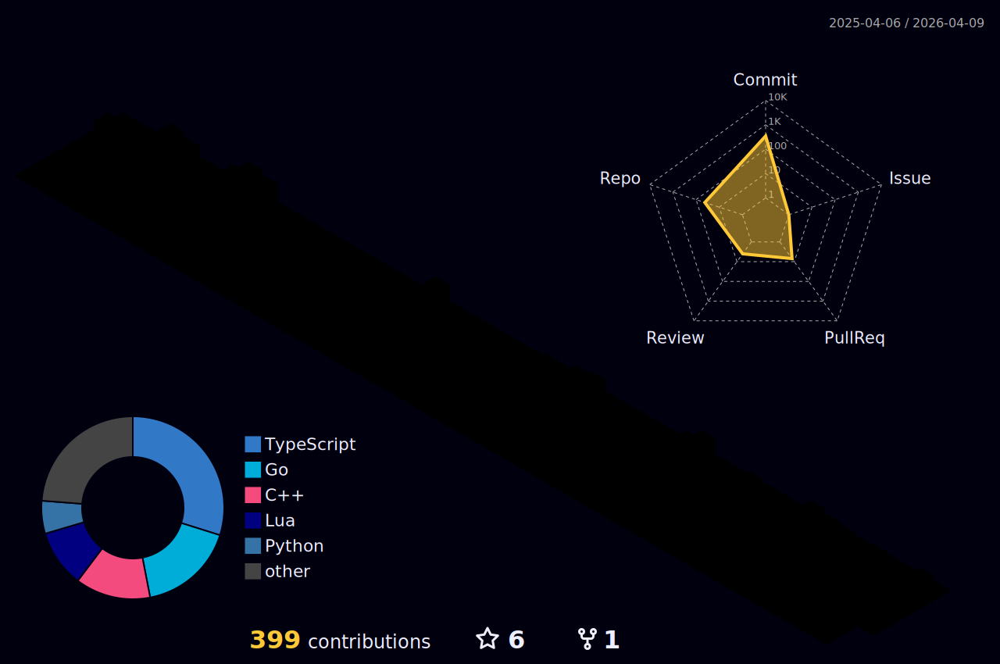

##  Software Engineer | [abhigyanmohanta.tech](https://abhigyanmohanta.tech)


- Hi 👋, This is Abhigyan!
- Full Stack/Software Developer
- Skills: Java, Elixir, Next.js, React, React Native, Redux, Node, Express, MongoDB, PostgreSQL, TypeScript, Python, Docker
- Built: Everything from full stack websites to mobile and desktop apps, automation softwares to chrome extensions
- Learning: AI/ML, Phoenix Framework and Go
- Resume: [Link](https://abhigyan-mohanta.github.io/resume/)


##  Github Stats
<!--START_SECTION:waka-->

```txt
From: 26 July 2025 - To: 02 August 2025

TypeScript   5 hrs 9 mins    █████████████████████▓░░░   87.28 %
Go           20 mins         █▒░░░░░░░░░░░░░░░░░░░░░░░   05.75 %
YAML         15 mins         █░░░░░░░░░░░░░░░░░░░░░░░░   04.23 %
JSON         8 mins          ▓░░░░░░░░░░░░░░░░░░░░░░░░   02.31 %
CSS          1 min           ░░░░░░░░░░░░░░░░░░░░░░░░░   00.39 %
```

<!--END_SECTION:waka-->

