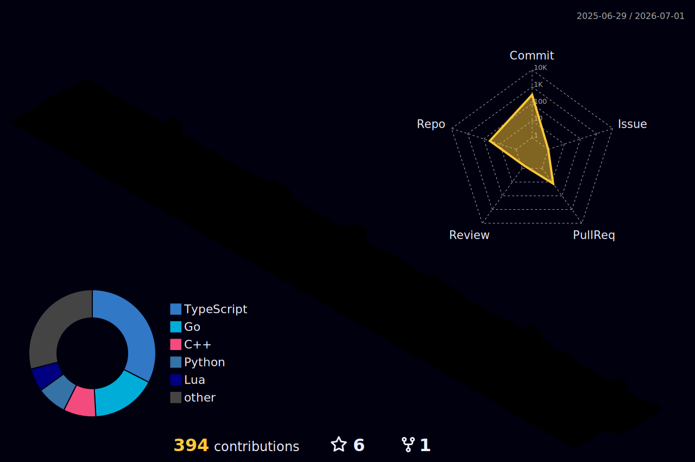

##  Software Engineer 


- Hi 👋, This is Abhigyan!
- Full Stack/Software Developer
- Skills: Java, Elixir, Next.js, React, React Native, Redux, Node, Express, MongoDB, PostgreSQL, TypeScript, Python, Docker
- Built: Everything from full stack websites to mobile and desktop apps, automation softwares to chrome extensions
- Learning: AI/ML, Phoenix Framework and Go
- Resume: [Link](https://abhigyan-mohanta.github.io/resume/)


##  Github Stats
<!--START_SECTION:waka-->

```txt
From: 11 April 2026 - To: 18 April 2026

Other        4 hrs 5 mins          ███████▓░░░░░░░░░░░░░░░░░   30.59 %
Python       3 hrs 24 mins         ██████▒░░░░░░░░░░░░░░░░░░   25.44 %
Go           2 hrs 38 mins         █████░░░░░░░░░░░░░░░░░░░░   19.69 %
Markdown     1 hr 42 mins          ███▒░░░░░░░░░░░░░░░░░░░░░   12.74 %
TypeScript   48 mins               █▓░░░░░░░░░░░░░░░░░░░░░░░   06.08 %
```

<!--END_SECTION:waka-->

