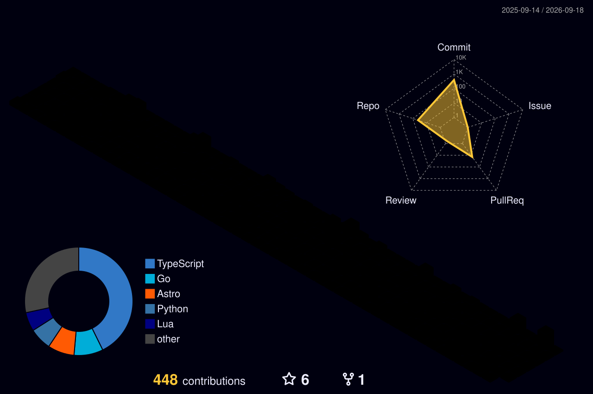

##  Software Engineer 


- Hi 👋, This is Abhigyan!
- Full Stack/Software Developer
- Skills: Java, Elixir, Next.js, React, React Native, Redux, Node, Express, MongoDB, PostgreSQL, TypeScript, Python, Docker
- Built: Everything from full stack websites to mobile and desktop apps, automation softwares to chrome extensions
- Learning: AI/ML, Phoenix Framework and Go
- Resume: [Link](https://abhigyan-mohanta.github.io/resume/)


##  Github Stats
<!--START_SECTION:waka-->

```txt
From: 29 June 2026 - To: 06 July 2026

Go           3 hrs 5 mins          ██████▒░░░░░░░░░░░░░░░░░░   25.51 %
Other        1 hr 53 mins          ████░░░░░░░░░░░░░░░░░░░░░   15.62 %
TypeScript   1 hr 25 mins          ███░░░░░░░░░░░░░░░░░░░░░░   11.70 %
HTTP         1 hr 11 mins          ██▒░░░░░░░░░░░░░░░░░░░░░░   09.77 %
Markdown     50 mins               █▓░░░░░░░░░░░░░░░░░░░░░░░   07.01 %
```

<!--END_SECTION:waka-->

